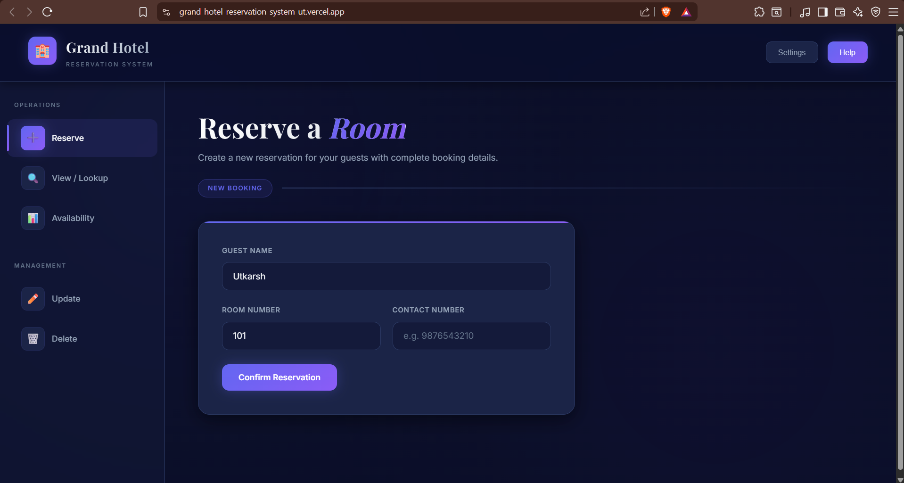
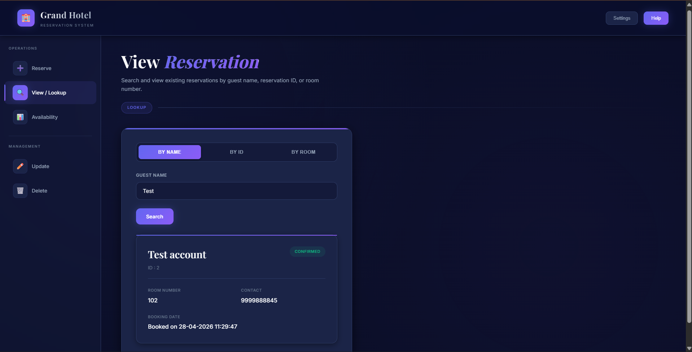
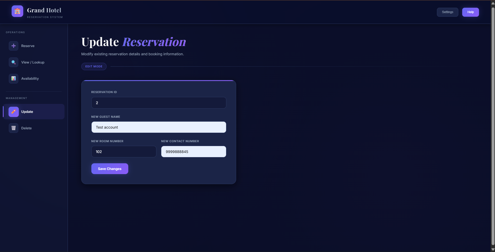
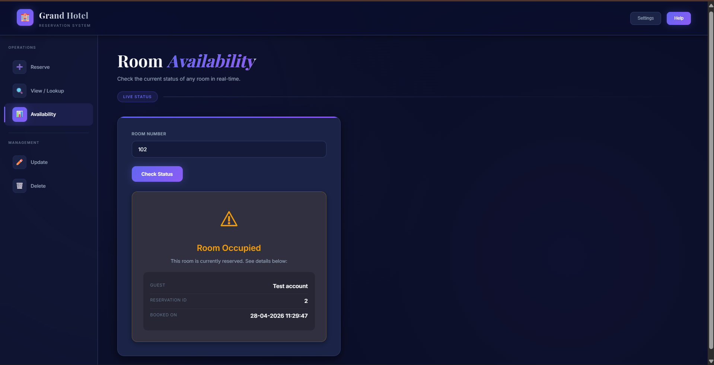
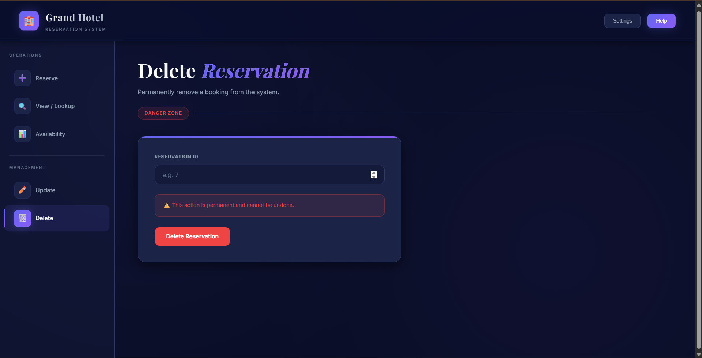

# 🏨 Grand Hotel Reservation System

A full-stack hotel reservation system built using **Spring Boot (Backend)** and **HTML, CSS, JavaScript (Frontend)**.  
This application allows users to create, view, search, and delete hotel reservations with a clean UI and RESTful APIs.

---

## 🚀 Live Demo

- https://grand-hotel-reservation-system-ut.vercel.app/

---

## 📌 Features

- ✅ Create new reservation  
- 🔍 Search reservation by:
  - Guest Name  
  - Reservation ID  
  - Room Number  
- 📋 View all reservations  
- ❌ Delete reservation  
- 📡 REST API integration  
- 🎨 Clean and modern UI  
- ☁️ Fully deployed (Frontend + Backend + Database)  

---

## 🛠️ Tech Stack

### 🔹 Frontend
- HTML  
- CSS  
- JavaScript (Fetch API)  

### 🔹 Backend
- Java  
- Spring Boot  
- Spring Data JPA  
- Hibernate  

### 🔹 Database
- MySQL (Railway)  

## 🎥 Demo Preview

  

---

## 📸 Screenshots

### ➕ Create Reservation

  

### 🔍 Search Reservation

  

### 📋 Update Details

  

### 📋 availability Details

  

### ❌ Delete Confirmation

  

### 🔹 Deployment
- Frontend: Vercel  
- Backend: Render  
- Database: Railway  

---

## 📂 Project Structure
Frontend/
│── index.html

Backend/
│── src/main/java/com/hotelreservation/backend
│── src/main/resources/application.properties
│── pom.xml

---

## ⚙️ API Endpoints

### ➤ Create Reservation
POST /api/reservations

### ➤ Get All Reservations

GET /api/reservations

### ➤ Get Reservation by ID

GET /api/reservations/{id}

### ➤ Search by Guest Name

GET /api/reservations/search?guestName=xyz

### ➤ Get by Room Number

GET /api/reservations/room/{roomNumber}

### ➤ Delete Reservation

DELETE /api/reservations/{id}

---

## 🧪 How to Run Locally

### 1️⃣ Clone Repository

git clone https://github.com/your-username/your-repo-name.git

cd your-repo-name

### 2️⃣ Backend Setup

cd backend
mvn clean install
mvn spring-boot:run

### 3️⃣ Frontend Setup
Simply open:

index.html

---

## 🔐 Environment Variables

DB_URL=your_database_url
DB_USER=your_username
DB_PASS=your_password

---

## 🧠 Key Learnings

- REST API development with Spring Boot  
- Frontend ↔ Backend integration using Fetch API  
- Database handling with JPA & Hibernate  
- Deployment using Render, Vercel, and Railway  
- Debugging real-world production issues  

---

## 🚀 Future Improvements

- 🔐 User Authentication (Login/Register)  
- 📊 Admin Dashboard  
- 📅 Booking Date Selection  
- 💳 Payment Integration  
- 🤖 AI-based Room Recommendation  

---

## 👨‍💻 Author

**Utkarsh Pandey**

- 🎓 BSc Computer Science (3rd Year)  
- 💻 Aspiring Backend Developer  

---

## ⭐ Support

If you found this project helpful, give it a ⭐ on GitHub!